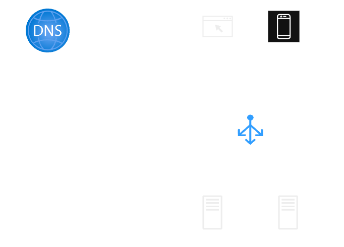
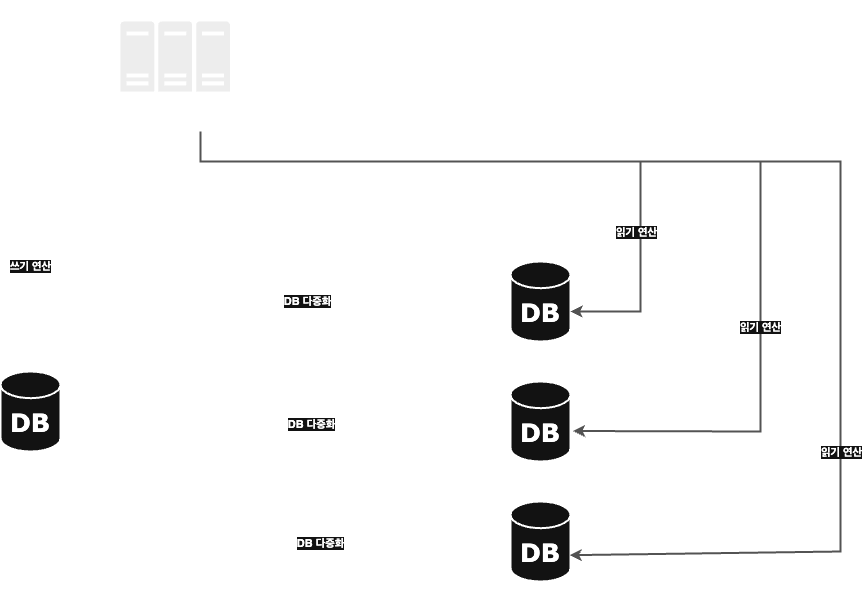

# 사용자 수 따른 규모 확장성
## 단일 서버

1. 사용자는 도메인 이름 (api.mysite.com)을 이용하여 웹사이트에 접속한다.  
도메인 이름을 도메인 이름 서비스 (DNS)에 질의하여 IP 주소로 변환한다.
2. DNS 조회 결과로 IP 주소가 반환된다.
3. 해당 IP 주소로 HTTP 요청이 전달된다.
4. 요청을 받은 웹 서버는 HTML 페이지나 JSON 형태의 응답을 반환한다.

## 데이터베이스
> 웹/모바일 트래픽 처리 서버(웹 계층) | 데이터베이스 서버(데이터 계층) 으로 분리한다.

### 관계형 데이터 베이스 (RDBMS)
* MySQL, 오라클 데이터베이스, PostgreSQL 등
* 자료를 테이블과 열, 칼럼으로 표현
* SQL을 사용하면 여러 테이블에 있는 데이터를 그 관계에 따라 조인(join)하여 합칠 수 있다.
* 대부분의 경우 사용됨

### 비 관계형 데이터 베이스 (NoSQL)
* CouchDB, Neo4j, Cassandra, HBase, Amazon DynamoDB 등
* 키-값 저장소, 그래프 저장소, 칼럼 저장소, 문서 저장소로 나뉜다.
* 일반적으로 조인연산은 지원하지 않는다.
* 선택 시 요구사항  
    * 아주 낮은 응답 지연시간(latency)
    * 다루는 데이터가 비정형이라 관계형 데이터가 아님
    * 데이터(JSON, YAML, XML)를 직렬화하거나 역직렬화 할 수 있기만 하면 됨
    * 아주 많은 양의 데이터를 저장할 경우

## 수직적 규모 확장 vs 수평적 규모 확장
* 수직적 규모 확장(scale up, vertical scaling) : 서버에 고사양 자원을 추가하는 행위
    * 장점 : 트래픽의 양이 적을 때 사용. 비교적 단순하다.
    * 단점 : 리소스 한계가 있고, 장애에 대한 자동복구(failover) 방안이나 다중화 방안을 제시하지 않는다. 
* 수평적 규모 확장(scale out) : 더 많은 서버를 추가하여 성능을 개선하는 행위 

## 로드밸런서
부하 분산 집합에 속한 웹 서버들에게 트래픽 부하를 고르게 분산하는 역할

사용자는 로드밸런서의 공개 IP 주소 (Public IP address) 로 접속, 서버 간 통신은 사설 IP 주소(Private IP address)가 이용된다.
* 서버1이 다운되면, 모든 트래픽은 서버2로 전송된다. -> 웹사이트 전체가 다운되는 상황 방지
* 웹사이트로 유입되는 트래픽이 빠르게 증가하면 웹 서버 계층에 더 많은 서버를 추가한다. -> 로드밸런서가 자동으로 트래픽 분산

## 데이터베이스 다중화
* 보통 서버 사이에 주(master)-부(slave) 관계를 설정하고 데이터 원본은 주 서버에, 사본은 부 서버에 저장하는 방식
* 쓰기 연산은 마스터에서만 지원하며, 슬레이브에서는 마스터로부터 사본을 전달받고, 읽기 연산만을 지원한다.

