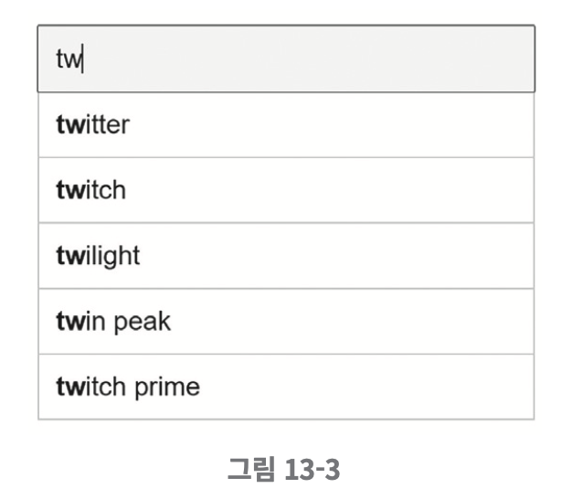
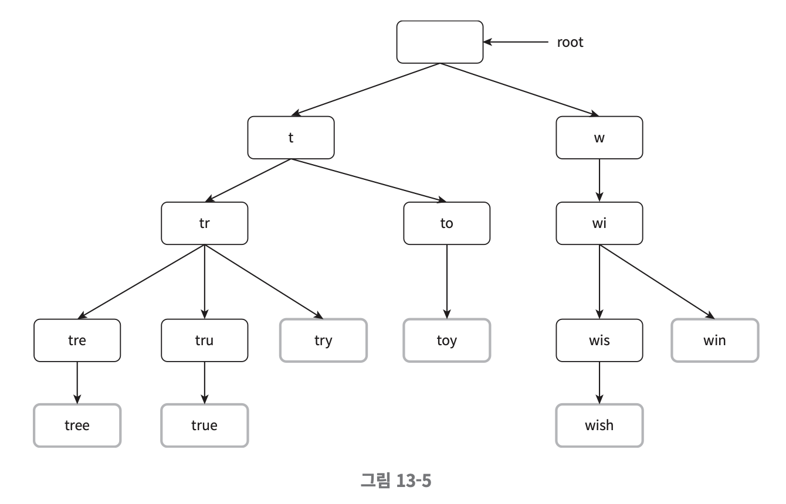
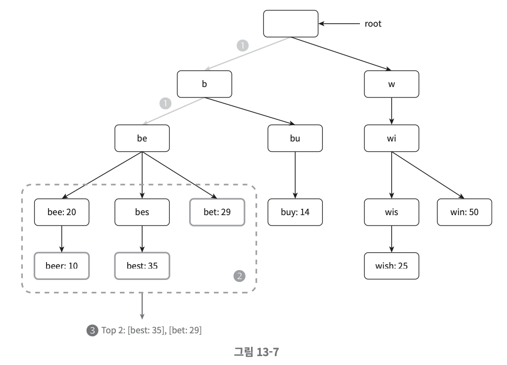

# 검색어 자동완성 시스템
## 1단계 - 문제 이 및 설계 범위 확정
#### **요구사항**
* 빠른 응답속도 : 사용자가 검색어를 입력함에 따라 자동완성 검색어도 빠르게 표시되어야 한다.
* 연관성 : 자동완성되어 출력되는 검색어는 사용자가 입력한 단어와 연관된 것이어야 한다.
* 정렬 : 시스템의 계산 결과는 인기도 등의 순위 모델에 의해 정렬되어 있어야 한다.
* 규모 확장성 : 시스템은 많은 트래픽을 감당할 수 있도록 확장 가능해야 한다.
* 고가용성 : 시스템의 일부에 장애가 발생하거나 느려지거나, 예상치 못한 네트워크 문제가 생겨도 시스템은 계속 사용 가능해야 한다.

#### **개략적 규모추정**
* 일간 능동 사용자(DAU)는 천만 명으로 가정한다.
* 평균적으로 한 사용자는 매일 10건의 검색을 수행한다고 가정한다.
* 질의할 때마다 평균적으로 20바이트의 데이터를 입력한다고 가정한다.
    * 문자 인코딩 방법으로는 ASCII를 사용한다고 가정할 것이므로, 1문자 = 1바이트이다.
    * 질의문은 평균적으로 4개 단어로 이루어진다고 가정하고, 각 단어는 평균적으로 다섯 글자로 구성된다고 가정할 것이다.
    * 따라서 질의당 평균 4 X 5 = 20바이트이다.
* 검색창에 글자를 입력할 때마다 클라이언트는 검색어 자동완성 백엔드에 요청을 보낸다. 따라서 평균적으로 1회 검색당 20건의 요청이 백엔드로 전달된다.
* 대략 초당 24,000건의 질의(QPS)가 발생할 것이다.
* 최대 QPS=QPS x 2=대략 48,000
* 질의 가운데 20% 정도는 신규 검색어라고 가정할 것이다. 따라서 대략 0.4GB정도로, 매일 0.4GB의 신규 데이터가 시스템에 추가된다는 뜻이다.

## 2단계 - 개략적 설계안 제시 및 동의 구하기
개략적으로 보면 시스템은 두 부분으로 나뉜다.
### 데이터 수집 서비스

질의문과 사용빈도를 저장하는 빈도 테이블이 있다고 가정.
처음에는 비어있지만 사용자가 'twitch', 'twitter', 'twitter', 'twillo'를 순서대로 검색하면 그 상태가 위 그림과 같이 바뀌어 나가게 된다.
### 질의 서비스

* query : 질의문을 저장하는 필드
* frequency : 질의문의 사용된 빈도를 저장하는 필드
이 상태에서 사용자가 "tw"를 검색창에 입력하면 아래의 "top 5" 자동완성 검색어가 표시되어야 한다.
"top 5"는 위의 빈도 테이블에 기록된 수치를 사용해 계산한다고 가정한다.

가장 많이 사용된 5개의 검색어는 SQL 질의문을 사용해 계산할 수 있다.
~~~shell
SELECT * FROM frequency_table
WHERE query Like `prefix%`
ORDER BY frequency DESC
LIMIT 5
~~~
-> 데이터 양이 적을 때는 나쁘지 않지만, 데이터가 많아지면 병목현상이 발생할 수 있다.

## 3단계 - 상세 설계
컴포넌트를 골라 상세 설계하여 최적화 방안을 논의한다.
### 트라이 자료구조
> ✅ 문자열들을 간략하게 저장할 수 있는 자료구조로, 문자열을 꺼내는 연산에 초점을 맞추어 설계된 자료구조이다.
* 핵심 아이디어
    * 트라이는 티리 형태의 자료구조이다.
    * 이 트리의 루트 노드는 빈 문자열을 나타낸다.
    * 각 노드는 글자(character) 하나를 저장하며, 26개(해당 글자 다음에 등장할 수 있는 모든 글자의 개수)의 자식노드를 가질 수 있다.
    * 각 트리 노드는 하나의 단어, 또는 접두어 문자열을 나타낸다.

아래는 `tree`, `try`, `true`, `toy`, `wish`, `win` 가 보관된 트라이이다. 

* 이용 빈도에 따라 정렬된 결과를 내놓기 위해 노드에 빈도 정보를 저장

    ~~~
    ✅ 용어정리
    - p: 접두어(prefix)의 길이
    - n: 트라이 안에 있는 노드 개수
    - c: 주어진 노드의 자식 노드 개수
    ~~~
    * 가장 많이 사용된 질의어 k개 찾기
        * 해당 접두어를 표현하는 노드를 찾는다. 시간 복잡도는 O(p)
        * 해당 노드부터 시작하는 하위 트리를 탐색하여 모든 유효 노드를 찾는다.
        * 유효 노드들을 정렬하여 가장 인기 있는 검색어 k개를 찾는다. 시간복잡도 O(clogc)
* 예제
> k=2 이고, 사용자가 검색창에 'be'를 입력한 경우

~~~
✅ 알고리즘 동작
1. 접두어 노드 'be'를 찾는다.
2. 해당 노드부터 시작하는 하위 트리를 탐색하여 모든 유효 노드를 찾는다. 
3. 유효 노드를 정렬하여 2개만 골라낸다.
~~~