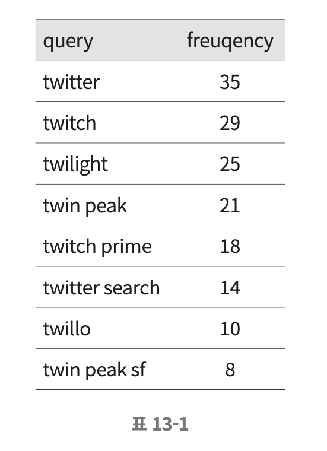
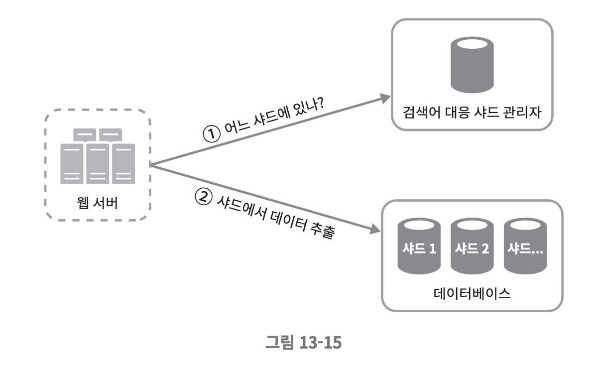

# 검색어 자동완성 시스템
## 1단계 - 문제 이 및 설계 범위 확정
#### **요구사항**
* 빠른 응답속도 : 사용자가 검색어를 입력함에 따라 자동완성 검색어도 빠르게 표시되어야 한다.
* 연관성 : 자동완성되어 출력되는 검색어는 사용자가 입력한 단어와 연관된 것이어야 한다.
* 정렬 : 시스템의 계산 결과는 인기도 등의 순위 모델에 의해 정렬되어 있어야 한다.
* 규모 확장성 : 시스템은 많은 트래픽을 감당할 수 있도록 확장 가능해야 한다.
* 고가용성 : 시스템의 일부에 장애가 발생하거나 느려지거나, 예상치 못한 네트워크 문제가 생겨도 시스템은 계속 사용 가능해야 한다.

#### **개략적 규모추정**
* 일간 능동 사용자(DAU)는 천만 명으로 가정한다.
* 평균적으로 한 사용자는 매일 10건의 검색을 수행한다고 가정한다.
* 질의할 때마다 평균적으로 20바이트의 데이터를 입력한다고 가정한다.
    * 문자 인코딩 방법으로는 ASCII를 사용한다고 가정할 것이므로, 1문자 = 1바이트이다.
    * 질의문은 평균적으로 4개 단어로 이루어진다고 가정하고, 각 단어는 평균적으로 다섯 글자로 구성된다고 가정할 것이다.
    * 따라서 질의당 평균 4 X 5 = 20바이트이다.
* 검색창에 글자를 입력할 때마다 클라이언트는 검색어 자동완성 백엔드에 요청을 보낸다. 따라서 평균적으로 1회 검색당 20건의 요청이 백엔드로 전달된다.
* 대략 초당 24,000건의 질의(QPS)가 발생할 것이다.
* 최대 QPS=QPS x 2=대략 48,000
* 질의 가운데 20% 정도는 신규 검색어라고 가정할 것이다. 따라서 대략 0.4GB정도로, 매일 0.4GB의 신규 데이터가 시스템에 추가된다는 뜻이다.

## 2단계 - 개략적 설계안 제시 및 동의 구하기
개략적으로 보면 시스템은 두 부분으로 나뉜다.
### 데이터 수집 서비스

질의문과 사용빈도를 저장하는 빈도 테이블이 있다고 가정.
처음에는 비어있지만 사용자가 'twitch', 'twitter', 'twitter', 'twillo'를 순서대로 검색하면 그 상태가 위 그림과 같이 바뀌어 나가게 된다.
### 질의 서비스

* query : 질의문을 저장하는 필드
* frequency : 질의문의 사용된 빈도를 저장하는 필드
이 상태에서 사용자가 "tw"를 검색창에 입력하면 아래의 "top 5" 자동완성 검색어가 표시되어야 한다.
"top 5"는 위의 빈도 테이블에 기록된 수치를 사용해 계산한다고 가정한다.

가장 많이 사용된 5개의 검색어는 SQL 질의문을 사용해 계산할 수 있다.
~~~shell
SELECT * FROM frequency_table
WHERE query Like `prefix%`
ORDER BY frequency DESC
LIMIT 5
~~~
-> 데이터 양이 적을 때는 나쁘지 않지만, 데이터가 많아지면 병목현상이 발생할 수 있다.

## 3단계 - 상세 설계
컴포넌트를 골라 상세 설계하여 최적화 방안을 논의한다.
### 트라이 자료구조
> ✅ 문자열들을 간략하게 저장할 수 있는 자료구조로, 문자열을 꺼내는 연산에 초점을 맞추어 설계된 자료구조이다.
* 핵심 아이디어
    * 트라이는 티리 형태의 자료구조이다.
    * 이 트리의 루트 노드는 빈 문자열을 나타낸다.
    * 각 노드는 글자(character) 하나를 저장하며, 26개(해당 글자 다음에 등장할 수 있는 모든 글자의 개수)의 자식노드를 가질 수 있다.
    * 각 트리 노드는 하나의 단어, 또는 접두어 문자열을 나타낸다.

아래는 `tree`, `try`, `true`, `toy`, `wish`, `win` 가 보관된 트라이이다. 

* 이용 빈도에 따라 정렬된 결과를 내놓기 위해 노드에 빈도 정보를 저장

    ~~~
    ✅ 용어정리
    - p: 접두어(prefix)의 길이
    - n: 트라이 안에 있는 노드 개수
    - c: 주어진 노드의 자식 노드 개수
    ~~~
    * 가장 많이 사용된 질의어 k개 찾기
        * 해당 접두어를 표현하는 노드를 찾는다. 시간 복잡도는 O(p)
        * 해당 노드부터 시작하는 하위 트리를 탐색하여 모든 유효 노드를 찾는다.
        * 유효 노드들을 정렬하여 가장 인기 있는 검색어 k개를 찾는다. 시간복잡도 O(clogc)
* 예제
> k=2 이고, 사용자가 검색창에 'be'를 입력한 경우

~~~
✅ 알고리즘 동작
1. 접두어 노드 'be'를 찾는다.
2. 해당 노드부터 시작하는 하위 트리를 탐색하여 모든 유효 노드를 찾는다. 
3. 유효 노드를 정렬하여 2개만 골라낸다.
~~~

> 시간 복잡도 = O(p) + O(c) + O(clogc) 
이는 직관적이지만 최악의 경우 k개 결과를 얻으려고 해도 전체 트라이를 다 검색해야하는 일이 생길 수 있다.
~~~
✅ 해결 방법
1. 접두어의 최대 길이를 제한
2. 각 노드의 인기 검색어를 캐시
~~~

* 접두어 최대 길이 제한
사용자가 검색창에 긴 검색어를 입력하는 일은 거의 없기 때문에, p값은 작은 정숫값(ex. 50)이라고 가정해도 안전하다.  
검색어의 최대 길이를 제한할 수 있다면 접두어 노드를 찾는 단계의 시간 복잡도는 O(p) 에서 O(작은 상숫값)=O(1) 로 바뀔것이다.

* 노드에 인기 검색어 캐시

    * 각 노드에 k개의 인기 검색어를 저장 해두면 전체 트라이를 검색하는 일을 방지할 수 있다. (시간복잡도 = O(1))
    * 각 노드에 질의어를 저장할 공간이 많이 필요하게 된다는 단점이 있다.
    * 빠른 응답속도가 아주 중요할 때는 희생할 만한 가치가 있다.

    > 💡 각 단계의 시간 복잡도가 O(1)로 바뀐 덕에 최고 인기 검색어 k개를 찾는 전체 알고리즘의 복잡도는 O(1) 로 바뀌게 된다.

### 데이터 수집 서비스
지금 까지의 설계안은 사용자가 검색창에 타이핑 할 때마다 실시간으로 데이터를 수정했는데, 이는 실용적이지 못하다.
~~~
❗️ 문제점
1. 매일 수천만 건의 질의가 입력될 텐데 그때마다 트라이를 갱신하면 질의 서비스는 현저히 느려질 것이다.
2. 일단 트라이가 만들어 지고 나면 인기 검색어는 그다지 자주 바뀌지 않을것이므로 잦은 갱신이 필요 없다.
~~~
즉, 데이터가 어디서 오고 이용되는 곳이 어디인지를 파악한다.  
-> 트위터는 검색어 갱신이 빨라야 하지만 구글 검색같은 애플리케이션은 그럴 필요 없다.

* **데이터 분석 서비스 로그** : 검색창에 입력된 질의에 관한 원본 데이터가 보관된다. 새로운 데이터가 추가될 뿐 수정은 이루어지지 않으며 로그 데이터에는 인덱스를 걸지 않는다.
    * 로그 파일 예제  
        

* **로그 취합 서버** : 데이터 분석 서비스로부터 나오는 로그는 보통 그 양이 엄청나고 데이터 형식도 제각각이라, 이 데이터를 잘 취합하여 우리 시스템이 쉽게 소비할 수 있도록 해야 한다.
* **취합된 데이터** : time 필드는 해당 주가 시작한 날짜를 나타내고, frequency 필드는 해당 질의가 해당 주에 사용된 횟수의 합이다.
    
* **작업 서버** : 작업 서버는 주기적으로 비동기적 작업을 실행하는 서버 집합이다. 트라이 자료구조를 만들고 트라이 데이터베이스에 저장하는 역할을 담당한다.
* **트라이 캐시** : 분산 캐시 시스템으로 트라이 데이터를 메모리에 유지하여 읽기 연산 성능을 높이는 구실을 한다. 매주 트라이 데이터베이스의 스냅샷을 떠서 갱신한다.
* **트라이 데이터베이스** : 지속성 저장소로 사용할 수 있는 선택지로는 다음 두가지가 있다.
    * 문서 저장소(document store)
        * 새 트라이를 매주 만들 것이므로, 주기적으로 트라이를 직렬화하여 데이터베이스에 저장할 수 있다. 
        * 몽고디비 같은 문서 저장소를 활용하여 편리하게 저장
    * 키-값 저장소 : 해시 테이블 형태로 변환 가능
        * 트라이에 보관된 모든 접두어를 해시 테이블 키로 변환
        * 각 트라이 노드에 보관된 모든 데이터를 해시 테이블 값으로 변환  
        
        
        [**트라이를 해시테이블로 대응 시키는 예시**]
        

### 질의 서비스

1. 검색 질의가 로드밸런서로 전송된다.
2. 로드밸런서는 해당 질의를 API 서버로 보낸다.
3. API 서버는 트라이 캐시에서 데이터를 가져와 해당 요청에 대한 자동완성 검색어 제안 응답을 구성한다.
4. 데이터가 트라이 캐시에 없는 경우에는 데이터를 데이터베이스에서 가져와 캐시에 채운다.  
-> 다음에 같은 접두어에 대한 질의가 오면 캐시에 보관된 데이터를 사용해 처리할 수 있다.  
-> 캐시미스는 캐시 서버의 메모리가 부족하거나 캐시 서버에 장애가 있어도 발생할 수 있다.

**[질의 서비스 최적화 방안]**
* AJAX 요청 : 요청을 보내고 받기 위해 페이지를 새로고침 할 필요가 없다는 것이 장점이다.
* 브라우저 캐싱 : 제안된 검색어들을 브라우저 캐시에 넣어두면 후속 질의의 결과는 해당 캐시에서 바로 가져갈 수 있다.
* 데이터 샘플링 : 대규모 시스템의 경우, 모든 질의 결과를 로깅하도록 해 놓으면 CPU 자원과 저장공간을 엄청나게 소진하게 되는데, N개 요청 가운데 1개만 로깅하도록 한다.

### 트라이 연산
* 트라이 생성 : 작업 서버가 담당하며, 데이터 분석 서비스의 로그나 데이터베이스로부터 취합된 데이터를 이용한다.
* 트라이 갱신
    1. 매주 한번 갱신하는 방법 - 새로운 트라이를 만든 다음 기존 트라이를 대체한다.
    2. 트라이의 각 노드를 갱신하는 방법 - 성능이 떨어지며, 트라이가 작을 때 고려해 볼만 하다.
* 검색어 삭제 : 위험한 질의어를 자동완성 결과에서 제거해야 한다.
    
    * 트라이 앞에 필터 계층을 두고 부적절한 질의어가 반환되지 않도록 하는 것
    * 필터 계층을 두면 필터 규칙에 따라 검색 결과를 자유롭게 변경할 수 있다는 장점이 있다.
    * 검색어를 물리적으로 삭제하는 것은 다음번 업데이트 사이클에 비동기적으로 진행하면 된다.
### 저장소 규모 확장
> 💡 트라이의 크기가 한 서버에 넣기엔 너무 큰 경우 대응할 수 있도록 규모 확장성 문제 해결 필요

**[첫 글자를 기준으로 샤딩하는 방법]**
* 두 대의 서버가 필요한 경우
    * ‘a’부터 ‘m’까지로 시작하는 검색어는 첫 번째 서버에, 나머지는 두 번째 서버에 저장한다.
* 세 대의 서버가 필요한 경우
    * ‘a’부터 ‘i’까지는 첫 번째 서버에, ‘j’부터 ‘r’까지는 두 번째 서버에, 나머지는 세 번째 서버에 저장한다.
> 이 방법을 쓰는 경우 사용 가능한 서버는 최대 26대로 제한되며, 서버 대수를 더 늘리려면 샤딩을 계층적으로 해야한다.

* ‘a’로 시작하는 검색어를 네 대의 서버에 나눠서 보관하는 경우
    * ‘aa’~’ag’, ‘ah’~’an’, ‘ao’~’au’, 나머지로 4개의 서버로 나누어 보관하면 된다.
    * c’로 시작하는 단어가 ‘x’로 시작하는 단어보다 많다는 것을 감안하면 좋은 방법이라 할 수 없다.

**[과거 질의 데이터의 패턴을 분석하여 샤딩하는 방법]**

* 검색어 대응 관리자 : 어떤 검색어가 어느 저장소 서버에 저장되는지에 대한 정보를 관리
    * ex) ‘s’로 시작하는 검색어의 양이 ‘u’, ‘v’, ‘w’, ‘x’, ‘y’, ‘z’로 시작하는 검색어를 전부 합친 것과 비슷하다면
’s’에 대한 샤드 하나와 ‘u’~’z’까지의 검색어를 위한 샤드 하나를 두어도 충분할 것.

## 4단계 - 마무리
> 추가로 고려해볼만한 질문

Q. 다국어 지원이 가능하도록 시스템을 확장하려면?
A. 비영어권 국가에서 사용하는 언어를 지원하려면 트라이에 유니코드 데이터를 저장해야 한다.

Q. 국가별로 인기 검색어 순위가 다르다면?
A. 국가별로 다른 트라이를 사용하도록 한다. 트라이를 CDN에 저장하여 응답속도를 높일 수도 있다.

Q. 실시간으로 변하는 검색어의 추이를 반영하려면?
A. 현 설계안은 적절하지 않다.
    1. 작업 서버가 매주 한 번씩 돌도록 설정되어있어 시의 적절하게 트라이를 갱신할 수 없다.
    2. 트라이를 갱신한다고 해도, 트라이를 구상하는 데 너무 많은 시간이 소요된다.

> ❗️ 추가 아이디어
> 1. 샤딩을 통해 작업 대상 데이터의 양을 줄인다.
> 2. 순위 모델을 바꾸어 최근 검색어에 보다 높은 가중치를 주도록 한다.
> 3. 데이터가 스트림 형태로 올 수 있다는 점, 즉 한번에 모든 데이터를 동시에 사용할 수 없을 가능성이 있다는 점을 고려해야 한다.