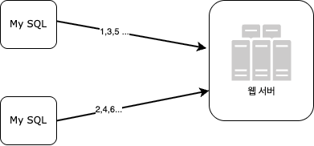
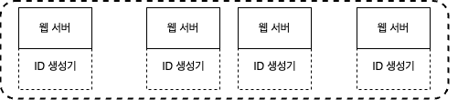
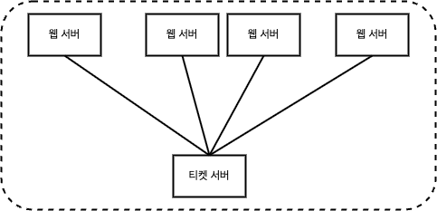

# 분산 시스템을 위한 유일 ID 생성기 설계

## 1단계 - 문제 이해 및 설계 범위 확정
* 적절한 질문을 통해 모호함을 없애고 설계 방향을 정하기

## 2단계 - 개략적 설계안 제시 및 동의 구하기
### 다중 마스터 복제 (multi-master replication)

* 데이터 베이스의 `auto_increment` 기능을 활용하는 것, 다음 ID의 값을 구할 때 1만큼이 아니라 k만큼 증가시킨다.
* 단점
    * 여러 데이터 센터에 걸쳐 규모를 늘리기 어렵다.
    * ID의 유일성은 보장되겠지만 그 값이 시간 흐름에 맞추어 커지도록 보장할 수는 없다.
    * 서버를 추가하거나 삭제할 때도 잘 동작하도록 만들기 어렵다.
### UUID

* 유일성이 보장되는 ID를 만드는 또다른 방법
* 컴퓨터 시스템에 저장되는 정보를 유일하게 식별하기 위한 128비트짜리 수
* 충돌 가능성이 지극히 낮음
* 각 웹 서버는 별도의 ID 생성기를 사용해 독립적으로 ID를 만들어 낸다.
* 장점
    * UUID를 만드는 것은 단순함, 서버 사이의 조율이 필요 없으므로 동기화 이슈도 없다.
    * 각 서버가 자기가 쓸 ID를 알아서 만드는 구조이므로 규모 확장도 쉽다.
* 단점
    * ID가 128비트로 길다. (이번 장: 64비트)
    * ID를 시간순으로 정렬할 수 없다.
    * ID에 숫자 아닌 값이 포함될 수 있다.
### 티켓 서버

* 핵심은 `auto_increment` 기능을 갖춘 데이터베이스 서버, 즉 티켓 서버를 중앙 집중형으로 하나만 사용하는 것
* 장점
    