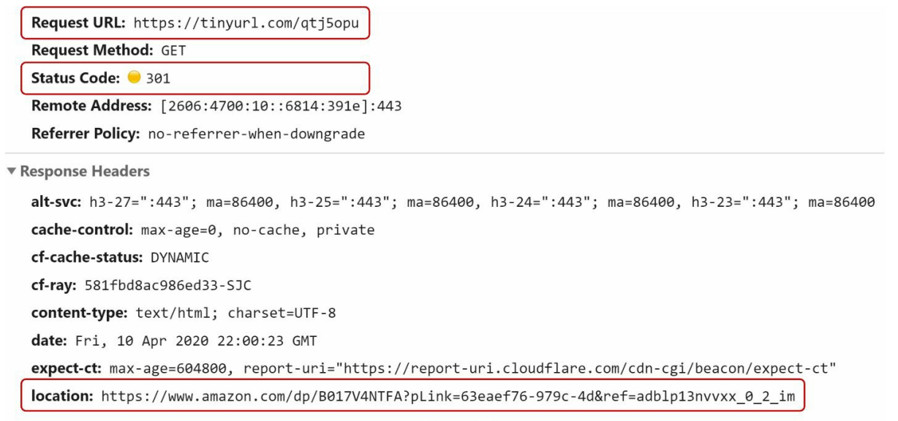
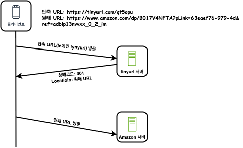
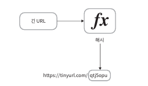
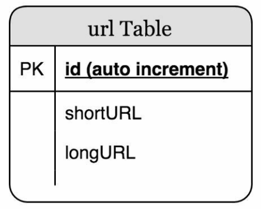

# URL 단축기 설계
## 1단계 - 문제 이해 및 설계 범위 확정
* 질문을 통해 추린 요구사항 정리
    1. URL 단축 : 주어진 긴 URL을 훨씬 짧게 줄인다.
    2. URL 리디렉션 : 축약된 URL로 HTTP 요청이 오면 원래 URL로 안내
    3. 높은 가용성과 규모 확장성, 장애 감내가 요구됨
<details>
    <summary> 개략적 추정 </summary>
    1. 쓰기 연산 : 매일 1억 개의 단축 URL 생성</br>
    2. 초당 쓰기 연산: 1억/24/3600=1160</br>
    3. 읽기 연산 : 읽기 연산과 쓰기 연산 비율은 10:1, 그 경우 읽기 연산은 초당 11,600회 발생</br>
    4. URL 단축 서비스를 10년간 운영한다고 가정하면 1억 x 365 x 10 = 3650억 개의 레코드를 보관해야 한다.</br>
    5. 축약 전 URL의 평균 길이는 100 -> 따라서 10년 동안 필요한 저장 용량은 3650억 x 100바이트 = 36.5TB</br>     
</details>
    
## 2단계 - 개략적 설계안 제시 및 동의 구하기
* API 엔드포인트, URL 리디렉션, URL 단축 플로

### API 엔드포인트
* 클라이언트는 서버가 제공하는 엔드포인트를 통해 서버와 통신한다.
* 이 엔드포인트를 REST API로 설계한다.
* URL 단축기는 기본적으로 두 개의 엔드포인트를 필요로 한다.

1. URL 단축용 엔드포인트 : 새 단축 URL을 생성하고자 하는 클라이언트는 이 엔드포인트에 단축할 URL을 인자로 실어서 POST 요청을 보내야 한다.

    ```bash
    # POST/api/v1/data/shorten
    - 인자 : {longUrl: longURLstring!}
    - 반환 : 단축 URL
    ```

2. URL 리디렉션용 엔드포인트 : 단축 URL에 대해서 HTTP 요청이 오면 원래 URL로 보내주기 위한 용도의 엔드포인트

    ```bash
    # GET/api/v1/shortUrl
    - 반환 : HTTP 리디렉션 목적지가 될 원래 URL
    ```
### URL 리디렉션

> 단축 URL을 받은 서버는 그 URL을 원래 URL로 바꾸어서 301 응담의 Location 헤더에 넣어 반환한다.


> 301 응답과 302 응답의 차이를 유의해야 한다. 
1. 301 Permanently Moved: 이 응답은 해당 URL에 대한 HTTP 요청의 처리 책임이 영구적으로  Location 헤더에 반환된 URL로 이전되었다는 응답  
영구이전 되었으므로, 브라우저는 이 응답을 캐시(cache)한다. 따라서 추후 같은 단축 URL에 요청을 보낼 필요가 있을 때 브라우저는 캐시된 원래 URL로 요청을 보내게 된다.
2. 302 Found : 주어진 URL로의 요청이 '일시적으로' Location 헤더가 지정하는 URL에 의해 처리되어야 한다는 응답  
따라서 클라이언트의 요청은 언제나 단축 URL 서버에 먼저 보내진 후 원래 URL로 리디렉션 되어야 한다.

* 서버 부하를 줄이는 것이 중요한 경우 : `301 Permanently Moved` 사용 - 첫번 째 요청만 단축 URL 서버로 전송될 것이기 때문이다.
* 트래픽 분석이 중요한 경우 : `302 Found` 사용 - 클릭 발생률이나 발생 위치를 추적하는데 유리하다.
* 해시 테이블 사용 : URL 리디렉션을 구현하는 가장 직관적인 방법
    * 원래 URL=hashTable.get(단축 URL)
    * 301 또는 302 응답 Location 헤더에 원래 URL을 넣은 후 전송

### URL 단축
긴 URL 을 해시 값으로 대응시킬 해시 함수 fx를 찾는것이 중요하다.



이 해시 함수는 다음 요구사항을 만족해야 한다.
* 입력으로 주어지는 긴 URL이 다른 값이면 해시 값도 달라야 한다.
* 계산된 해시 값은 원래 입력으로 주어졌던 긴 URL로 복원될 수 있어야 한다.

## 3단계 - 상세 설계
### 데이터 모델
개략적 설계 시 해시 테이블에 사용하였으나, 실제 시스템에서는 메모리가 유한하기 때문에 비용문제가 있다.
실제 시스템을 설계할 때 더 나은 방법은 `<단축 URL, 원래 URL>` 의 순서쌍을 관계형 데이터베이스에 저장하는 것이다.



### 해시 함수
원래 URL을 단축 URL로 변환하는 데 쓰인다.  
* 단축 URL 값 = hashValue

#### 해시 값 길이
* hashValue : [0-9, a-z, A-Z]의 문자들로 구성된다. (사용할 수 있는 문자의 개수 : 10+26+26=62개)
* 개략적으로 계산하면 3650억 개의 URL을 만들어 낼 수 있다.

#### 해시 후 충돌 해소
긴 URL을 줄이려면, 원래 URL을 7글자 문자열로 줄이는 해시함수가 필요하다.
손쉬운 방법은 CRC32, MD5, SHA-1 과 같이 잘 알려진 해시 함수를 이용하는 것이다.
* 해싱 예시
URL : https://en.wikipedia.org/wiki/Systems_design

    ```bash
    CRC32 : 5cb54054
    MD5 : 5a62509a84df9ee03fe1230b9df8b84e
    SHA-1 : 0eeae7916c06853901d9ccbefbfcaf4de57ed85b
    ```
    > CRC32가 계산한 가장 짧은 해시값도 7보다는 길다.  
    이를 해결할 방법은 다음과 같다.

    * 계산된 해시 값에서 처음 7개 글자만 이용하는 것 : 해시 충돌 확률이 올라간다. 따라서 충돌이 발생하면 해소하는 작업이 필요하다. 
  