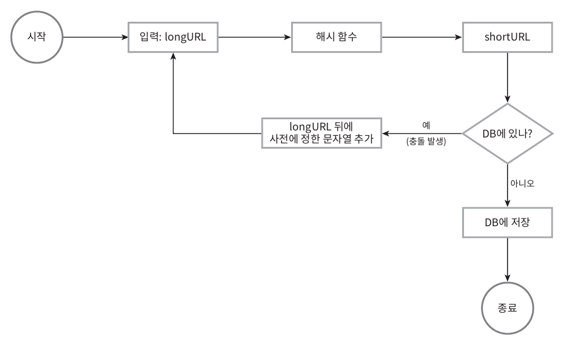
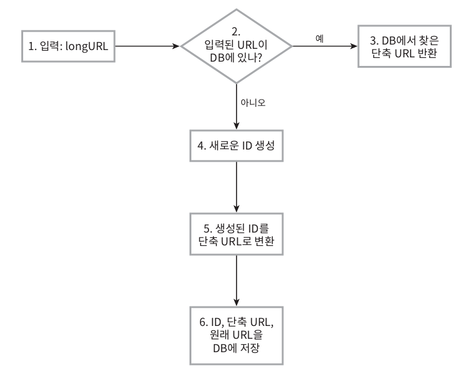
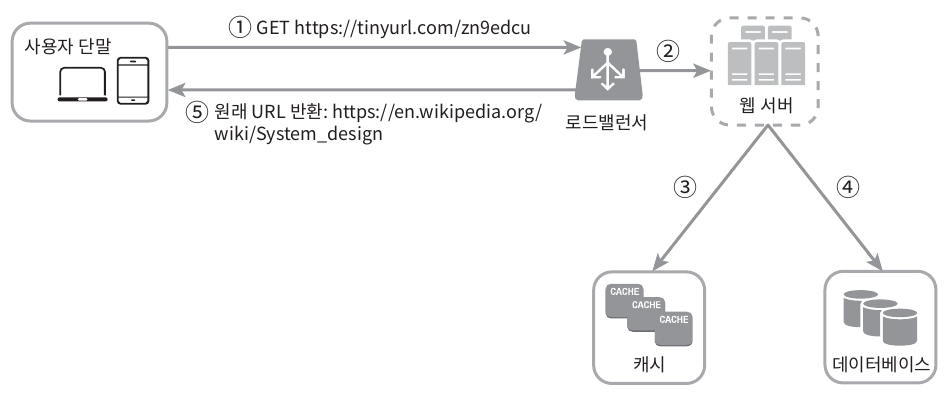

# URL 단축기 설계
## 1단계 - 문제 이해 및 설계 범위 확정
* 질문을 통해 추린 요구사항 정리
    1. URL 단축 : 주어진 긴 URL을 훨씬 짧게 줄인다.
    2. URL 리디렉션 : 축약된 URL로 HTTP 요청이 오면 원래 URL로 안내
    3. 높은 가용성과 규모 확장성, 장애 감내가 요구됨
<details>
    <summary> 개략적 추정 </summary>
    1. 쓰기 연산 : 매일 1억 개의 단축 URL 생성</br>
    2. 초당 쓰기 연산: 1억/24/3600=1160</br>
    3. 읽기 연산 : 읽기 연산과 쓰기 연산 비율은 10:1, 그 경우 읽기 연산은 초당 11,600회 발생</br>
    4. URL 단축 서비스를 10년간 운영한다고 가정하면 1억 x 365 x 10 = 3650억 개의 레코드를 보관해야 한다.</br>
    5. 축약 전 URL의 평균 길이는 100 -> 따라서 10년 동안 필요한 저장 용량은 3650억 x 100바이트 = 36.5TB</br>     
</details>
    
## 2단계 - 개략적 설계안 제시 및 동의 구하기
* API 엔드포인트, URL 리디렉션, URL 단축 플로

### API 엔드포인트
* 클라이언트는 서버가 제공하는 엔드포인트를 통해 서버와 통신한다.
* 이 엔드포인트를 REST API로 설계한다.
* URL 단축기는 기본적으로 두 개의 엔드포인트를 필요로 한다.

1. URL 단축용 엔드포인트 : 새 단축 URL을 생성하고자 하는 클라이언트는 이 엔드포인트에 단축할 URL을 인자로 실어서 POST 요청을 보내야 한다.

    ```bash
    # POST/api/v1/data/shorten
    - 인자 : {longUrl: longURLstring!}
    - 반환 : 단축 URL
    ```

2. URL 리디렉션용 엔드포인트 : 단축 URL에 대해서 HTTP 요청이 오면 원래 URL로 보내주기 위한 용도의 엔드포인트

    ```bash
    # GET/api/v1/shortUrl
    - 반환 : HTTP 리디렉션 목적지가 될 원래 URL
    ```
### URL 리디렉션

> 단축 URL을 받은 서버는 그 URL을 원래 URL로 바꾸어서 301 응담의 Location 헤더에 넣어 반환한다.


> 301 응답과 302 응답의 차이를 유의해야 한다. 
1. 301 Permanently Moved: 이 응답은 해당 URL에 대한 HTTP 요청의 처리 책임이 영구적으로  Location 헤더에 반환된 URL로 이전되었다는 응답  
영구이전 되었으므로, 브라우저는 이 응답을 캐시(cache)한다. 따라서 추후 같은 단축 URL에 요청을 보낼 필요가 있을 때 브라우저는 캐시된 원래 URL로 요청을 보내게 된다.
2. 302 Found : 주어진 URL로의 요청이 '일시적으로' Location 헤더가 지정하는 URL에 의해 처리되어야 한다는 응답  
따라서 클라이언트의 요청은 언제나 단축 URL 서버에 먼저 보내진 후 원래 URL로 리디렉션 되어야 한다.

* 서버 부하를 줄이는 것이 중요한 경우 : `301 Permanently Moved` 사용 - 첫번 째 요청만 단축 URL 서버로 전송될 것이기 때문이다.
* 트래픽 분석이 중요한 경우 : `302 Found` 사용 - 클릭 발생률이나 발생 위치를 추적하는데 유리하다.
* 해시 테이블 사용 : URL 리디렉션을 구현하는 가장 직관적인 방법
    * 원래 URL=hashTable.get(단축 URL)
    * 301 또는 302 응답 Location 헤더에 원래 URL을 넣은 후 전송

### URL 단축
긴 URL 을 해시 값으로 대응시킬 해시 함수 fx를 찾는것이 중요하다.


이 해시 함수는 다음 요구사항을 만족해야 한다.
* 입력으로 주어지는 긴 URL이 다른 값이면 해시 값도 달라야 한다.
* 계산된 해시 값은 원래 입력으로 주어졌던 긴 URL로 복원될 수 있어야 한다.

## 3단계 - 상세 설계
### 데이터 모델
개략적 설계 시 해시 테이블에 사용하였으나, 실제 시스템에서는 메모리가 유한하기 때문에 비용문제가 있다.
실제 시스템을 설계할 때 더 나은 방법은 `<단축 URL, 원래 URL>` 의 순서쌍을 관계형 데이터베이스에 저장하는 것이다.


### 해시 함수
원래 URL을 단축 URL로 변환하는 데 쓰인다.  
* 단축 URL 값 = hashValue

#### 해시 값 길이
* hashValue : [0-9, a-z, A-Z]의 문자들로 구성된다. (사용할 수 있는 문자의 개수 : 10+26+26=62개)
* 개략적으로 계산하면 3650억 개의 URL을 만들어 낼 수 있다.

#### 1️⃣ 해시 후 충돌 해소
긴 URL을 줄이려면, 원래 URL을 7글자 문자열로 줄이는 해시함수가 필요하다.
손쉬운 방법은 CRC32, MD5, SHA-1 과 같이 잘 알려진 해시 함수를 이용하는 것이다.
* 해싱 예시
URL : `https://en.wikipedia.org/wiki/Systems_design`

    ```bash
    CRC32 : 5cb54054
    MD5 : 5a62509a84df9ee03fe1230b9df8b84e
    SHA-1 : 0eeae7916c06853901d9ccbefbfcaf4de57ed85b
    ```
    > CRC32가 계산한 가장 짧은 해시값도 7보다는 길다. 

    
    > 충돌이 실제로 발생했을 때는, 충돌이 해소될 때까지 사전에 정한 문자열을 해시값에 덧붙인다.

#### 2️⃣ base-62 변환
* 진법 변환 : URL 단축기를 구현할 때 흔히 사용되는 접근법 중 하나로, 수의 표현 방식이 다른 두 시스템이 같은 수를 공유하여야 하는 경우에 유용하다.  
* 62진법 : hashValue에 사용할 수 있는 문자의 개수가 62개로, 0은 0, 9는 9, 10은 a, 11은 b, 35는 z, 36은 A, 61은 Z로 대응시켜 표현한다.
    * 예를 들어 11157=2TX 로 표현되며, 따라서 단축 URL은 `www.tinyurl.com/2TX` 이 된다.
​
#### ✅ 두 접근법 비교 
| 해시 후 충돌 해소 전략 |	base-62 변환 |
| --- | --- |
| 단축 URL의 길이가 고정됨 | 단축 URL의 길이가 가변적. ID값이 커지면 같이 길어짐 |
| 유일성이 보장되는 ID 생성기가 필요치 않음 |유일성 보장 ID 생성기가 필요 |
| 충돌이 가능해서 해소 전략이 필요 |ID의 유일성이 보장된 후에야 적용 가능한 전략이라 충돌은 아예 불가능 |
| ID로부터 단축 URL을 계산하는 방식이 아니라서 다음에 쓸 수 있는 URL을 알아내는 것이 불가능 | ID가 1씩 증가하는 값이라고 가정하면 다음에 쓸 수 있는 단축 URL이 무엇인지 쉽게 알아낼 수 있어서 보안상 문제가 될 소지가 있음 |

### URL 단축기 상세 설계

> URL 단축기는 처리 흐름이 논리적으로는 단순해야 하고, 기능적으로는 언제나 동작하는 상태가 유지 되어야 한다.
여기서는 62진법 변환 기법을 사용해 설계한다.

#### 💡 처리 흐름
1. 입력으로 긴 URL을 받는다.
2. 데이터베이스에 해당 URL이 있는지 검사한다.
3. 데이터베이스에 있다면 해당 URL에 대한 단축 URL을 만든 적이 있는 것이므로 데이터베이스에서 해당 단축 URL을 가져와 클라이언트에게 반환한다.
4. 데이터베이스에 없는 경우 해당 URL은 새로 접수된 것이므로 유일한 ID를 생성한다. 이 ID는 데이터베이스의 기본 키로 사용된다.
5. 62진법 변환을 적용, ID를 단축 URL로 만든다.
6. ID, 단축 URL, 원래 URL로 새 데이터베이스 레코드를 만든 후 단축 URL을 클라이언트에 전달한다.

### URL 리디렉션 상세 설계

> 쓰기보다 읽기를 더 자주 하는 시스템이라 <단축 URL, 원래 URL> 의 쌍을 캐시에 저장하여 성능을 높였다.

#### 💡 로드밸런서 동작 흐름
1. 사용자가 단축 URL을 클릭한다.
2. 로드밸런서가 해당 클릭으로 발생한 요청을 웹 서버에 전달한다.
3. 단축 URL이 이미 캐시에 있는 경우 원래 URL을 바로 꺼내서 클라이언트에게 전달한다.
4. 캐시에 해당 단축 URL이 없는 경우 데이터베이스에서 꺼낸다. (없다면 잘못 입력했을 가능성)
5. 데이터베이스에서 꺼낸 URL을 캐시에 넣은 후 사용자에게 반환한다.

## 4단계 - 마무리
### 추가적으로 고려해 볼 내용
* 처리율 제한 장치 : 위 설계안은 엄청난 양의 URL 단축 요청이 밀려들 경우 무력화 될 수 있는 잠재적 보안 결함을 가질 수 있어, 처리율 제한 장치를 두면 IP 주소를 비롯한 필터링 규칙들을 이용해 요청을 걸러낼수 있다.
* 웹 서버의 규모 확장 : 본 설계안의 웹 계층은 무상태 계층이므로 웹 서버를 자유롭게 증설하거나 삭제할 수 있다.
* 데이터베이스의 규모 확장 : 데이터베이스를 다중화하거나 샤딩하여 규모 확장성을 달성할 수 있다.
* 데이터 분석 솔루션 : 어떤 링크를 얼마나 많은 사용자가 클릭했는지, 언제 주로 클릭했는지 등 중요한 정보를 분석한다.
* 가용성, 데이터 일관성, 안정성 : 대규모 시스템이 성공적으로 운영되기 위해 반드시 갖추어야 할 속성